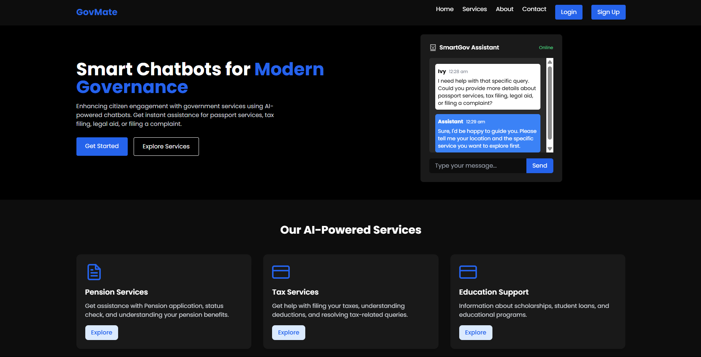
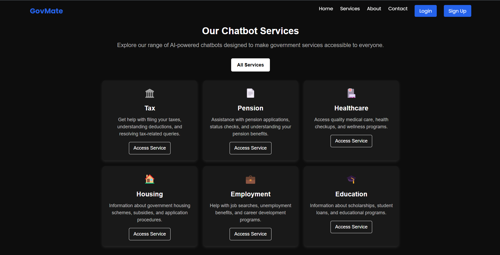
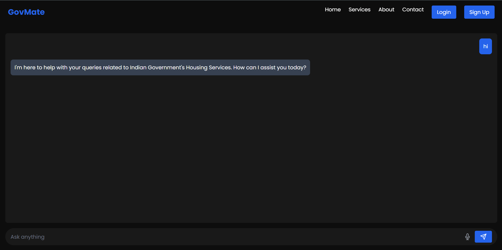

# GovMate: AI-Powered Government Services Chatbot

## Overview
**GovMate** is an AI-driven platform designed to simplify government processes and provide 24/7 support for citizens. It offers specialized chatbots for various government services, including tax filing, pension assistance, healthcare, housing, employment, and education. The platform leverages advanced AI technologies like **Pinecone** for vector search, **Groq** for natural language processing, and **Flask** for backend services.

---

## Features
- **Specialized Chatbots**: Dedicated chatbots for specific government services.
- **Voice-to-Text**: Interact with chatbots using voice commands.
- **Text-to-Speech**: Listen to chatbot responses with text-to-speech functionality.
- **Multi-Language Support**: Supports multiple languages for broader accessibility.
- **Real-Time Assistance**: Get instant answers and guidance for government-related queries.

---

## Technologies Used
- **Frontend**: React, Tailwind CSS
- **Backend**: Flask, Pinecone, Groq
- **Authentication**: Firebase Authentication
- **Voice Recognition**: Web Speech API
- **Text-to-Speech**: Web Speech API
- **Routing**: React Router
- **State Management**: React Hooks

---

## Setup Instructions

### 1. **Clone the Repository**
```bash
git clone https://github.com/your-username/govmate.git
cd govmate
```

### 2. **Backend Setup**

- Navigate to the backend folder:
  ```bash
  cd server
  ```

- Install Python dependencies:
  ```bash
  pip install -r requirements.txt
  ```

- Set up environment variables:
  Create a .env file in the backend folder.
  Add the following variables:
  ```env
  PINECONE_API=your_pinecone_api_key
  PINECONE_ENV=your_pinecone_environment
  GROQ_API=your_groq_api_key
  ```

- Run the Flask server:
  ```bash
  python app.py
  ```
  The backend will run on http://127.0.0.1:5000.

### 3. **Frontend Setup**

- Navigate to the frontend folder:
  ```bash
  cd App/project
  ```
  
- Install Node.js dependencies:
  ```bash
  npm install
  ```

### 4. **Firebase Authentication**

- Set up a Firebase project at Firebase Console.

- Add your Firebase configuration in src/firebase.js:
  ```javascript
  const firebaseConfig = {
  apiKey: "YOUR_API_KEY",
  authDomain: "YOUR_AUTH_DOMAIN",
  projectId: "YOUR_PROJECT_ID",
  storageBucket: "YOUR_STORAGE_BUCKET",
  messagingSenderId: "YOUR_MESSAGING_SENDER_ID",
  appId: "YOUR_APP_ID",
  };
  ```

- Enable Email/Password and Google authentication in the [Firebase Console](https://console.firebase.google.com/).

- Start the development server:
  ```bash
  npm run dev
  ```
  The frontend will run on http://localhost:5173.

---

## Usage

**1. Access the Platform:**
- Open your browser and navigate to http://localhost:5173.
- Explore the services or log in to access personalized features.
- 
**2. Interact with Chatbots:**
- Select a service (e.g., Tax, Pension, Healthcare).
- Type or speak your query to get instant assistance.

---

## Screenshots


*Caption: The application homepage.*


*Caption: Available Chatbots*


*Caption: Example of Chat*

---

## Acknowledgments

- **Pinecone** for vector search capabilities.
- **Groq** for powerful NLP models.
- **React** and Flask for building the frontend and backend.
- **Firebase** for authentication and user management.
